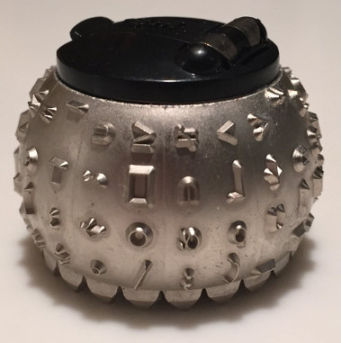

(What may now seem) syntax oddities in older programming languages
==================================================================

.. class:: titleslideinfo

    By Tibs / Tony Ibbs

    Presented at CamPUG_, virtually, 1st September 2020

    Written in reStructuredText_.

    Converted to PDF slides using rst2pdf_.

Introduction
------------

Looking at old, high level programming languages.

  "old" broadly means "before 1980"

  although mostly still in use, in one form or another

See the notes for credits for the source code examples, and links to resources.

.. Programming languages

   1957 FORTRAN / FORTRAN IV
   1958 LISP
   195x If-then-else
   1959 COBOL
   1960 (ish) Forth
   1960 Algol 60 sqq and stropping
   1962 ++ APL and J
   1962 Snobol
   1967 BCPL
   1972 Prolog
   1976 S and R
   1980 Smalltalk
   ABC
   Python

FORTRAN IV
----------

FORTRAN is the first high level language still in use today (in some form)

Early syntax heavily influenced by punch cards.

FORTRAN IV
----------

.. code:: fortran

        INTEGER BOTTLS
        DO 50 I = 1, 99
          BOTTLS = 100 - I
          PRINT 10, BOTTLS
          PRINT 20, BOTTLS
          PRINT 30
          BOTTLS = BOTTLS - 1
          PRINT 10, BOTTLS
          PRINT 40
  50    CONTINUE
        STOP
  10    FORMAT(1X, I2, 31H bottle(s) of beer on the wall.)
  20    FORMAT(1X, I2, 19H bottle(s) of beer.)
  30    FORMAT(34H Take one down and pass it around,)
  40    FORMAT(1X)
        END

A (FORTRAN) punched card
------------------------
   
.. image:: images/FortranCardPROJ039.agr.jpg
   :alt: Fortran punched card. Program text "Z(1) = Y + W(1)". Sequence number "PR0J039"
   :width: 80%

Fortran IV and punched cards
----------------------------

Comment Cards - first character is ``C``, rest are ignored.

Statement Cards

Data Cards
  
Fortran IV Statement Cards
--------------------------

Columns::

                   1         2         3             6         7            8
    12345 | 6 | 789012345678901234567890 .. ..  567890123456789012 | 34567890

1-5 are spaces or statement numbers ("labels")

6 is the "continuation" character

7-72 are program code

73-80 ignored, but normally used for card sequence

FORTRAN IV continued
--------------------

Spaces within program code are ignored.

.. code:: fortran

            G O T O 9 0 0

No reserved words, context gives meaning.

.. code:: fortran

            IF(IF.EQ.PROGRAM)IF=IF*PROGRAM

6 character variable names

.. code:: fortran

           BOTTLS = 99

.. page::

Implicit typing

.. code:: fortran

  C A variable starting I - N defaults to INTEGER, otherwise REAL
        I = 4
        R = 3.0

.. code::

Arithmetic IF
   
.. code:: fortran
          
        IF (X/Y*Z) 100,300,50
        
FORTRAN procedures: function
----------------------------

.. code:: fortran

  INTEGER FUNCTION ADD1(I)
    ADD1 = I + 1
  END

  J = ADD1(3)

Returns a single value.
        
FORTRAN procedures: subroutine
------------------------------

.. code:: fortran

  SUBROUTINE CALC(A,B,C,SUM,SUMSQ)
    SUM = A + B + C
    SUMSQ = SUM ** 2
  END

  CALL CALC(1,2,3,SUM1,SUMSQ1)

Returns 0 or more values, via its argument list.
  
LISP
----

LISP is the second oldest programming language still in common use.

It didn't end up quite how it was initially designed.

M- and S-expressions
--------------------

S-expressions (Symbolic expressions) were the data representation, and look
very much as we'd expect LISP to look.

M-expressions (Meta expressions) were intended as the notation for the writing
of recursive functions of S-expressions.

From the LISP 1.5 Programmer's Manual
-------------------------------------

M-expression

.. code::

   [atom[x] → x; T → ff[car[x]]]

becomes S-expression:

.. code:: lisp

   (COND ((ATOM X) X)
       ((QUOTE T) (FF (CAR X))))

LISP 2
------

.. code::

   % SUMSQUARE COMPUTES THE SUM OF THE SQUARES OF THE
   % COMPONENTS OF AN ARBITRARY VECTOR

   REAL SECTION COMPUTE, LISP;

   REAL FUNCTION SUMSQUARE(X(I));
      BEGIN INTEGER J; REAL Y;
              FOR J ← STEP 1 UNTIL I DO
                  Y ← Y + X(J) ↑ 2;
              RETURN Y;
      END;

   SUMSQUARE (2, 7, 4); STOP

.. code::

  69.0

Modern Lisps
------------

Common Lisp

.. code:: lisp

  (defun sum-of-squares (vector)
    (loop for x across vector sum (expt x 2)))

Scheme

.. code:: scheme

  (define (sum-of-squares l)
    (apply + (map * l l)))

Common Lisp 99 bottles
----------------------

.. code:: lisp

  (defun bottles (x)
    (loop for bottles from x downto 1
          do (format t "~a bottle~:p of beer on the wall~@
                        ~:*~a bottle~:p of beer~@
                        Take one down, pass it around~@
                        ~V[No more~:;~:*~a bottle~:p of~] beer on the wall~2%"
                    bottles (1- bottles))))

  (bottles 99)

Scheme 99 bottles
-----------------
.. code:: scheme

  (define bottles
    (lambda (n)
      (cond ((= n 0) (display "No more bottles"))
            ((= n 1) (display "One bottle"))
            (else (display n) (display " bottles")))
      (display " of beer")))
  (define beer
    (lambda (n)
      (if (> n 0)
          (begin
            (bottles n) (display " on the wall") (newline)
            (bottles n) (newline)
            (display "Take one down, pass it around") (newline)
            (bottles (- n 1)) (display " on the wall") (newline)
            (newline)
            (beer (- n 1))))))
  (beer 99)

...the inevitable xkcd cartoon

.. image:: images/lisp_cycles.png
   :scale: 500%
   :alt: XKCD comic, "These are your father's parentheses"

https://xkcd.com/297/ (Randall Monroe)

IF-THEN-ELSE
------------

According to https://en.wikipedia.org/wiki/Lisp_(programming_language

  A conditional using an if–then–else syntax was invented by McCarthy in a
  Fortran context. He proposed its inclusion in ALGOL, but it was not made
  part of the Algol 58 specification. For Lisp, McCarthy used the more general
  cond-structure. Algol 60 took up if–then–else and popularized it.

IF .. THEN .. ELSE appeared in FORTRAN in FORTRAN 77.

COBOL
-----

The third oldest programming language still in common use.

An attempt to make something suitable for business use.

COBOL 2002
----------

.. code:: cobol

  program-id. ninety-nine.
  data division.
  working-storage section.
  01  cnt       pic 99.

  procedure division.

    perform varying cnt from 99 by -1 until cnt < 1
      display cnt " bottles of beer on the wall"
      display cnt " bottles of beer"
      display "Take one down, pass it around"
      subtract 1 from cnt 
      display cnt " bottles of beer on the wall"
      add 1 to cnt
      display space
    end-perform.

COBOL old school (5 slides abbreviated)
---------------------------------------

I orginally had 5 slides of COBOL doing 99 bottles here. It started:

.. code:: cobol
	
  IDENTIFICATION DIVISION.
  PROGRAM-ID.BOTTLES_OF_BEER.
  AUTHOR.DONALD FRASER.

and ended:

.. code:: cobol

  WRITE-ROUTINE.
          MOVE BOTTLES TO NUMBER-OF-BEERS-1, NUMBER-OF-BEERS-2.
          COMPUTE BOTTLES = BOTTLES - 1.
          WRITE BEERS-OUT FROM LINE1.
          MOVE BOTTLES TO NUMBER-OF-BEERS-3.
          WRITE BEERS-OUT FROM LINE2.

Forth
-----

Stack based language

Very little syntax

A very simple Forth example
---------------------------

From https://www.whoishostingthis.com/resources/forth-programming/

.. code:: forth

  : OUTMATH             Output a mathematical calculation
    ." We will now calculate: (2 + 3) * 5" CR
    2 3 + 5 *
    ." This equals: " . CR ;

  OUTMATH

.. code::

  We will now calculate: (2 + 3) * 5
  This equals: 25

99 bottles in Forth
-------------------

.. code:: forth

  :noname   dup . ." bottles" ;
  :noname       ." 1 bottle"  ;
  :noname ." no more bottles" ;
  create bottles , , ,

  : .bottles  dup 2 min cells bottles + @ execute ;
  : .beer     .bottles ."  of beer" ;
  : .wall     .beer ."  on the wall" ;
  : .take     ." Take one down, pass it around" ;
  : .verse    .wall cr .beer cr
          1- .take cr .wall cr ;
  : verses    begin cr .verse ?dup 0= until ;

  99 verses

.. page::

or create a beer language (slide 1)

.. code:: forth

  DECIMAL
  : BOTTLES ( n -- )
          DUP
          CASE
          1 OF    ." One more bottle " DROP ENDOF
          0 OF    ." NO MORE bottles " DROP ENDOF
                  . ." bottles "    \ DEFAULT CASE
          ENDCASE ;

  : ,   [CHAR] , EMIT  SPACE 100 MS CR ;
  : .   [CHAR] . EMIT  300 MS  CR CR CR ;
  : OF       ." of "   ;     : BEER     ." beer " ;
  : ON       ." on "   ;     : THE      ." the "  ;
  : WALL     ." wall" ;      : TAKE     ." take " ;
  : ONE      ." one "  ;     : DOWN     ." down, " ;
  : PASS     ." pass " ;     : IT       ." it "   ;
  : AROUND   ." around" ;

.. page::

(slide 2)

.. code:: forth

  : POPONE    1 SWAP CR ;
  : DRINK     POSTPONE DO ; IMMEDIATE
  : ANOTHER   S" -1 +LOOP" EVALUATE ; IMMEDIATE
  : HOWMANY   S" I " EVALUATE ; IMMEDIATE
  : ONELESS   S" I 1- " EVALUATE ; IMMEDIATE
  : HANGOVER    ." :-("  CR QUIT ;

  : BEERS ( n -- )   \ Usage:  99 BEERS
        POPONE
        DRINK
          HOWMANY BOTTLES OF BEER ON THE WALL ,
          HOWMANY BOTTLES OF BEER ,
          TAKE ONE DOWN PASS IT AROUND ,
          ONELESS BOTTLES OF BEER ON THE WALL .
        ANOTHER 
        HANGOVER ;

The Algols - a selection
------------------------

ALGOL 60 - Tony Hoare said "Here is a language so far ahead of its time that
it was not only an improvement on its predecessors but also on nearly all its
successors."

ALGOL 68 - seen at the time as a very complex language

ALGOL W - Wirth's proposed successor to ALGOL 60, ancestor of PASCAL and
Modula-2

Simula 67 - ALGOL 60 with classes

Ada - designed for safety and developing large systems

Stropping
---------

In the older ALGOL languages, bold text would be used for keywords in
documentation:

      **int** a real int = 3;

but that didn't work in actual source code.

*Stropping* (from "apostrophe") uses extra characters to mark keywords.

.. page::

ALGOL 60 used QUOTE stropping

  .. code:: algol
            
     'int' intval = 3;

ALGOL 68 typically used UPPER stropping

  .. code:: algol

      INT a real int = 3;

or POINT stropping when working with 6 bit characters (no lower-case
characters)

  .. code:: algol

      .INT A REAL INT = 3;

Algol 68 could also use RES "stropping"; reserved words, as we'd expect

  .. code:: algol
            
      int a_real_int = 3;  # there are 61 accepted reserved words #

Algol 68: UPPER stropping
-------------------------

.. code:: algol68

    # Add an element to the end of the list #
    PROC append = ( REF LIST list, ELEMENT val ) VOID:
    BEGIN
      IF list IS empty
      THEN
        list := HEAP NODE := ( val, empty )
      ELSE
        REF LIST tail := list;
        WHILE next OF tail ISNT empty
        DO
          tail := next OF tail
        OD;
        next OF tail := HEAP NODE := ( val, empty )
      FI
    END;

APL and J
---------

Originally a mathematical notation for use in describing systems.

An implementation of an interpreted for "Iverson Notation", using English
reserved words instead of symbols, was available in 1965.

The first APL system to use the APL character set went live in 1966.

Kenneth E. Iversion received the Turing Award for his work on APL in 1979.

J is a version of APL using digraphs instead of the special symbols.

.. page::

For printing programs, Iverson and Falkoff got IBM to design a special type
ball for their 1050 and 2741 terminals.

99 bottles in APL and J
-----------------------

.. I never could figure out how to display this with pandoc/XeLaTeX, so am
.. resorting to a screen shot - and I hope that square glyph in the screenshot
.. is meant to be a square!
..
.. And now I'm using rst2pdf, which also doesn't default to coping, I've
.. already *got* the screenshot...
..
..  bob  ←  { (⍕⍵), ' bottle', (1=⍵)↓'s of beer'}
..  bobw ←  {(bob ⍵) , ' on the wall'}
..  beer ←  { (bobw ⍵) , ', ', (bob ⍵) , '; take one down and pass it around, ', bobw ⍵-1}
..  ↑beer¨ ⌽(1-⎕IO)+⍳99

.. image:: images/apl-larger.png
   :scale: 150%
   :alt: APL code

and its equivalent in J

.. code:: j

  bob =: ": , ' bottle' , (1 = ]) }. 's of beer'"_
  bobw=: bob , ' on the wall'"_
  beer=: bobw , ', ' , bob , '; take one down and pass it around, ' , bobw@<:
  beer"0 >:i.-99

Snobol
------

Pattern matching as the basis for a programming language.

Snobol
------

Command lines are made up of the *optional* parts::

  <label> <subject> <pattern> = <object> : <transfer>

The ``<subject>`` is matched against the ``<pattern>``

Any matched portion of ``<subject>`` is replaced with ``<object>``

``<transfer>`` is an absolute or conditional branch (to a ``<label>``)

A simple Snobol example
-----------------------

.. code:: snobol

            OUTPUT = "What is your name?"
            Username = INPUT
            Username "J"                                             :S(LOVE)
            Username "K"                                             :S(HATE)
  MEH       OUTPUT = "Hi, " Username                                 :(END)
  LOVE      OUTPUT = "How nice to meet you, " Username               :(END)
  HATE      OUTPUT = "Oh. It's you, " Username
  END

Snobol 99 bottles
-----------------

.. code:: snobol

  * 99 BOTTLES OF BEER IN SNOBOL (UNTESTED)
          BEER = 99
  MOREBEER OUTPUT = BEER ' BOTTLES OF BEER ON THE WALL'
          OUTPUT = BEER ' BOTTLES OF BEER'
          OUTPUT = 'TAKE ONE DOWN, PASS IT AROUND'
          BEER = BEER - 1
          OUTPUT = BEER ' BOTTLES OF BEER ON THE WALL'
          GT(BEER,0)   : S(MOREBEER)
          OUTPUT = 'NO MORE BOTTLES OF BEER ON THE WALL'
          OUTPUT = 'NO MORE BOTTLES OF BEER'
          OUTPUT = 'GO TO THE STORE AND BUY SOME MORE'
          OUTPUT = '99 BOTTLES OF BEER'
  END

BCPL
----

A small language designed to be easy to bootstrap, and for use in writing
compilers.

The ancestor of C.

Some things about BCPL
----------------------

Only one type: the word.

``$( .. )$`` to mark blocks

``IF .. THEN`` and ``TEST .. THEN .. ELSE``

A statement continues to the next line if it can't have ended (so, for
instance, if the last character was the ``+`` of an arithmetic expression

Labels are values, and since everything is a word, you can do arithmetic on
them.

.. page::

.. code:: bcpl

  GET "LIBHDR"
  MANIFEST $(
      BOTTLES = 99
  $)
  LET START() BE $(
      LET BEERS(N, S) BE $(
          TEST N = 0 THEN WRITEF("No more bottles")
                    ELSE WRITEF("%N bottle%S", N, (N = 1) -> "", "s")
          WRITEF(" of beer%S", S)
      $)
      FOR I = BOTTLES TO 1 BY -1 DO $(
              BEERS(I, " on the wall, ")
              BEERS(I, ".*NTake one down, pass it around.*N")
              BEERS(I - 1, " on the wall.*N")
      $)
      FINISH
  $)

Prolog
------

Logic language, declarative

Specify *relations* (facts and rules), and run a *query* over those relations

Uses full stop to end expressions/statements, not semicolon

.. page::

Tower of Hanoi
--------------

We want to define ``move(N,X,Y,Z)`` to move *n* disks from peg X to peg
Y, using peg Z as an intermediary::

           |        |        |
          xxx       |        |
         xxxxx      |        |
        xxxxxxx     |        |
     ________________________________
           X        Y        Z

Prolog solution from
http://www.cs.toronto.edu/~sheila/384/w11/simple-prolog-examples.html

.. page::

The description
---------------

To transfer a stack containing 1 disc from peg X to peg Y:

  Move that disc from X to Y

To transfer a stack containing *n* discs (recursively):

  Transfer the first *n-1* discs to peg Z

  Move the last disc on X to Y 

  Transfer the *n-1* discs from Z to peg Y

.. page::

The code
--------

.. code:: prolog

     move(1,X,Y,_) :-  
         write('Move top disk from '), 
         write(X), 
         write(' to '), 
         write(Y), 
         nl. 
     move(N,X,Y,Z) :- 
         N>1, 
         M is N-1, 
         move(M,X,Z,Y), 
         move(1,X,Y,_), 
         move(M,Z,Y,X).  
 
Running the code
----------------

.. code:: prolog

     ?-  move(3,left,right,center). 
     Move top disk from left to right 
     Move top disk from left to center 
     Move top disk from right to center 
     Move top disk from left to right 
     Move top disk from center to left 
     Move top disk from center to right 
     Move top disk from left to right 
      
     yes

Prolog 99 bottles
-----------------
      
.. code:: prolog

  bottles :-
      bottles(99).

  bottles(1) :- 
      write('1 bottle of beer on the wall, 1 bottle of beer,'), nl,
      write('Take one down, and pass it around,'), nl,
      write('Now they are alle gone.'), nl.
  bottles(X) :-
      X > 1,
      write(X), write(' bottles of beer on the wall,'), nl,
      write(X), write(' bottles of beer,'), nl,
      write('Take one down and pass it around,'), nl,
      NX is X - 1,
      write(NX), write(' bottles of beer on the wall.'), nl, nl,
      bottles(NX).

S and R
-------

Statistical programming

R is an implementation of S with some extensions. Much S code should run
unaltered in R.

.. page::

Simple looping solution in R

.. code:: r

  # a naive function to sing for N bottles of beer...
  song = function(bottles){
    for(i in bottles:1){ #for every integer bottles, bottles-1 ... 1
      cat(bottles," bottles of beer on the wall \n",bottles,
          " bottles of beer \nTake one down, pass it around \n",
          bottles-1, " bottles of beer on the wall \n"," \n" ,sep="")
          bottles = bottles - 1 #take one down...
    }
  }
  song(99)

.. page::
  
.. code:: r

  for (b in 99:1){
    print(b)
    print(" bottle(s) of beer on the wall,")
    print(b)
    print(" bottle(s) of beer.")
    print("Take one down, pass it around,")
    print(b-1)
    print(" bottle(s) of beer on the wall.")
    print("")
  }

Smalltalk
---------

Almost no syntax

Everything is an object

Messages get sent to objects:

.. code:: smalltalk

   'Hello, world' printNl !

.. code:: smalltalk

   1 to: 20 by: 2 do: [:x| x printNl ] !

.. page::

http://www.info.univ-angers.fr/pub/gh/hilapr/beers/schade/s.html#SmallTalk

.. code:: smalltalk

  "Programmer: patrick m. ryan - pryan@access.digex.net
  "http://www.access.digex.net/~pryan

  99 to: 1 by: -1 do: [ :i |
          i print. ' bottles of beer on the wall, ' print.
          i print. ' bottles of beer. ' print.
          'take one down, pass it around, ' print.
          (i-1) print. ' bottles of beer on the wall, ' print.

I think that's rather elegant.

.. page::

https://rosettacode.org/wiki/99_Bottles_of_Beer#Smalltalk

A straightforward approach

.. code:: smalltalk

  Smalltalk at: #sr put: 0 ; at: #s put: 0 !
  sr := Dictionary new.
  sr at: 0 put: ' bottle' ;
    at: 1 put: ' bottles' ;
    at: 2 put: ' of beer' ;
    at: 3 put: ' on the wall' ;
    at: 4 put: 'Take one down, pass it around' !
  99 to: 0 by: -1 do: [:v | v print.
          ( v == 1 ) ifTrue: [ s := 0. ] 
                      ifFalse: [ s := 1. ].
          Transcript show: (sr at:s) ; show: (sr at:2) ; show: (sr at:3) ; cr.
                      v print.
          Transcript show: (sr at:s) ; show: (sr at:2) ; cr.
                      (v ~~ 0) ifTrue: [ Transcript show: (sr at:4) ; cr. ].
    ].

ABC - Python's inspirational ancestor
-------------------------------------

Just for the sake of it

.. code:: abc

  HOW TO RETURN verse n:
    SELECT:
        n = 0:
          PUT "no more bottles of beer" IN s
        n = 1:
          PUT "1 bottle of beer" IN s
        ELSE:
          PUT "`n` bottles of beer" IN s
    RETURN s

.. page::

.. code:: abc

  HOW TO DRINK:
    PUT 99 IN num
    WHILE num > 0:
        WRITE verse num, " on the wall, ", verse num, "," /
        WRITE "take one down, pass it around," /
        PUT num - 1 IN num
        WRITE verse num, " on the wall." /

  DRINK

Python
------

I suppose I had to include this, just for comparison

.. code:: python

  def sing(b, end):
      print(b or 'No more','bottle'+('s' if b-1 else ''), end)

  for i in range(99, 0, -1):
      sing(i, 'of beer on the wall,')
      sing(i, 'of beer,')
      print('Take one down, pass it around,')
      sing(i-1, 'of beer on the wall.\n')

(mainly included to show how one should not necessarily judge a language from
the examples given!)

.. page::

Although I'm actually very fond of

.. code:: python

    """Pythonic 99 beer song (maybe the simplest naive implementation in Python 3)."""

    REGULAR_VERSE = """\
    {n} bottles of beer on the wall, {n} bottles of beer.
    Take one down and pass it around, {n_minus_1} bottles of beer on the wall.
    """
    ENDING_VERSES = """\
    2 bottles of beer on the wall, 2 bottles of beer.
    Take one down and pass it around, 1 bottle of beer on the wall.\n
    1 bottle of beer on the wall, 1 bottle of beer.
    Take one down and pass it around, no more bottles of beer on the wall.\n
    No more bottles of beer on the wall, no more bottles of beer.
    Go to the store and buy some more, 99 bottles of beer on the wall.
    """
    for n in range(99, 2, -1):
        print(REGULAR_VERSE.format(n=n, n_minus_1=n - 1))
    print(ENDING_VERSES)

Source of examples
------------------

The "99 bottles of beer" examples were from one of:

* https://rosettacode.org/wiki/99_Bottles_of_Beer/Lisp
* http://www.info.univ-angers.fr/pub/gh/hilapr/beers/schade/

Sum of squares (LISP) was from:

* https://rosettacode.org/wiki/Sum_of_squares

Full acknowledgements for everything are in the notes.

Fin
---

Written in reStructuredText_.

Converted to PDF slides using rst2pdf_.

Source and extended notes at https://github.com/tibs/old-proglang-syntaxes-talk

|cc-attr-sharealike| This slideshow and its related files are released under a
`Creative Commons Attribution-ShareAlike 4.0 International License`_.

.. |cc-attr-sharealike| image:: images/cc-attribution-sharealike-88x31.png
   :alt: CC-Attribution-ShareAlike image
   :align: middle

.. _`Creative Commons Attribution-ShareAlike 4.0 International License`: http://creativecommons.org/licenses/by-sa/4.0/

.. _CamPUG: https://www.meetup.com/CamPUG/
.. _reStructuredText: http://docutils.sourceforge.net/docs/ref/rst/restructuredtext.html
.. _rst2pdf: https://rst2pdf.org/
